# Experiment with Gemini prompts for your SAP RISE migration projects

## Overview

Moving to SAP S/4HANA Cloud can be complex, but with Gemini, you can streamline the process and boost efficiency. We conducted a series of workshops with our customers and identified several ideas and prompts that demonstrate how Google Gemini can help transform your enterprise systems.
In this lab, we'll dive into Vertex AI Studio and learn how to use powerful prompts to:

* Generate comprehensive functional documentation: Say goodbye to manual documentation! Gemini can automatically create detailed functional specs for your migration project.
* Understand and test ABAP code: Get clear explanations of existing ABAP code and even generate test cases for a smooth transition.
* Create and enhance UI documentation: Effortlessly generate user-friendly UI documentation and identify areas for improvement in your new S/4HANA system.
* Develop a robust infrastructure migration plan: Let Gemini help you map out your infrastructure migration, ensuring a seamless transition to the cloud.

Get ready to unlock the potential of Gemini and experience a faster, smoother, and more intelligent SAP migration journey!

Vertex AI is Google Cloud's unified service for managing machine learning and generative AI projects. Vertex AI Studio is a feature of Vertex AI. It makes writing and tuning prompts for text and code generation simple and intuitive. 

In this lab, you learn how to use Vertex AI Studio to create and experiment with prompts for various stages and use cases of your SAP migration project. 

## Objectives

In this lab, you will:
* Get familiar with Vertex AI Studio and how you can use it to quickly prototype your ideas with prompt for your IT projects
* Explore different models of Gemini family
* Explore and get inspired about the potential of Google Gemini to transform your IT landscape, in particular focusing on SAP use cases as an example

### Contributors
- Ekaterina Kruse
- Viktor Palkin

## Initial Login

Open your browser in the incognito mode

Navigate to [Google Cloud Console](https://console.cloud.google.com/)

Login using provided username and password.

If you are planning to use [AI Boost Toolbox for SAP RISE](https://console.cloud.google.com/), login to it as well with your own Google account in a separate window.

Confirm all messages appearing.


## Task 1: Learning the Vertex AI Studio user interface

1. In the Google Cloud console, from the Navigation menu (), select __Vertex AI__ from the __Artificial Intelligence__ section. 

2. From the Vertex AI dashboard, click the __Enable all Recommended APIs__ button. 

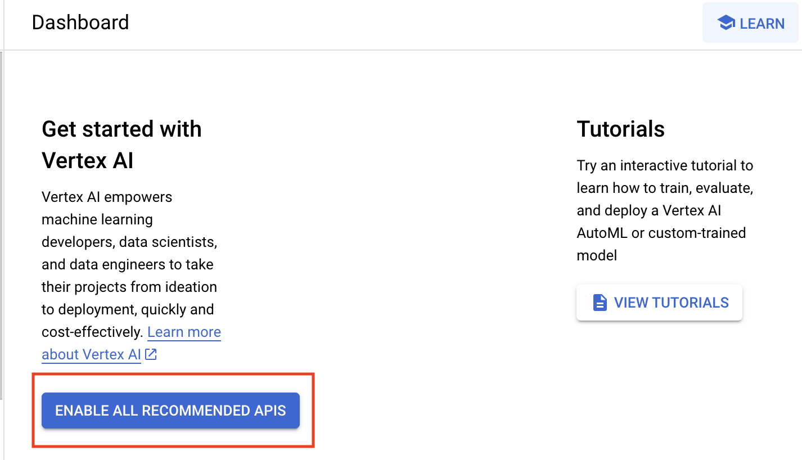

3. In the menu on the left, locate "VERTEX AI STUDIO" and open an Overview tab. Here you can select Open Freeform in Generate with Gemini section.

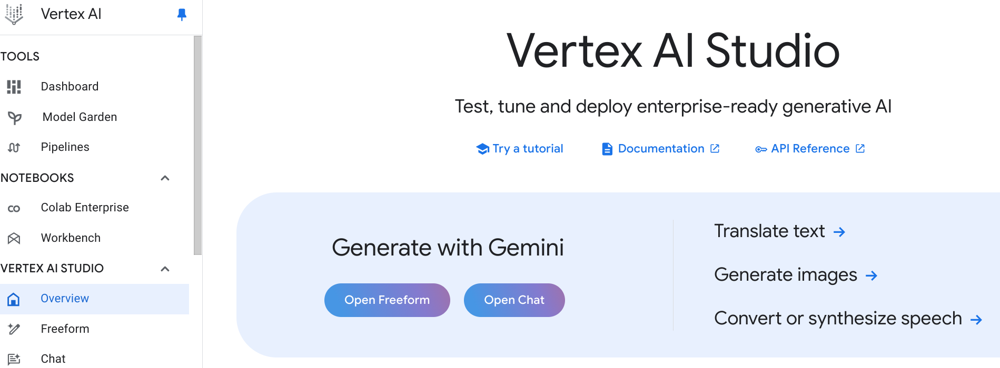
    
4. Users can input a free-form prompt, select the desired model version, and modify parameters to observe their effect on the model's output.  A simple prompt will be used for this initial test.

   **Prompt**: _"Explain the benefit of Google Cloud for hosting SAP systems."_

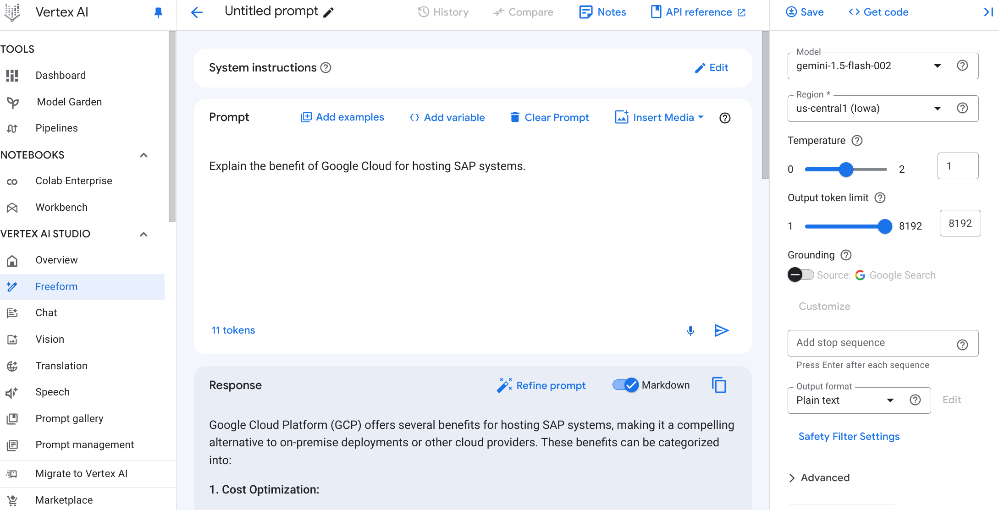

5. Experiment with different model versions and parameters, and observe how the output changes.


## Task 2: Generating functional documentation

Now, let's review the first prompt identified by our customers as a potential accelerator for transformation. One of the tasks during migration is creating a business case and functional documentation. Let's explore how Gemini can help with that using a few simple prompting techniques.

1. In the Vertex AI Studio freeform, edit the system instructions 

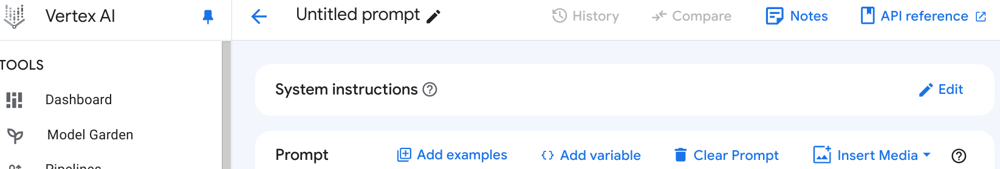

Add the following text and **Apply** the change: "You are an expert in SAP S/4HANA Finance and its advantages over SAP ECC6. Your task is to create a concise and informative document outlining the key benefits of migrating from ECC6 to S/4HANA, specifically focusing on the finance domain."

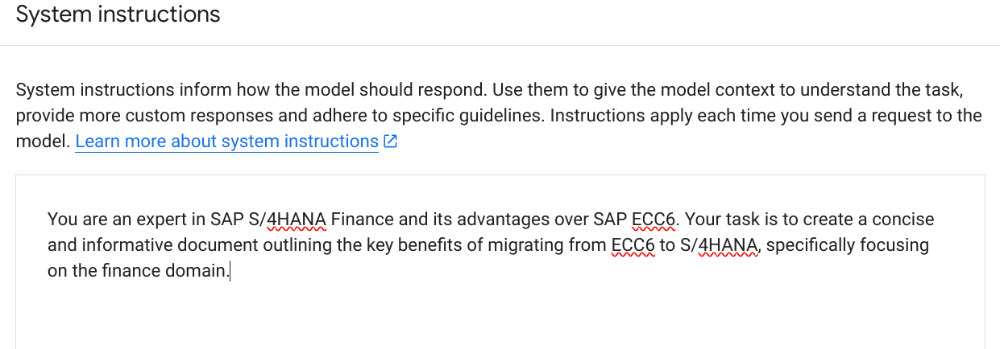

2. In the **Prompt** area, add the following prompt:

```
## Context: Many businesses are still using SAP ECC6 for their financial operations. However, SAP S/4HANA offers significant improvements in various areas, including finance. 

## Task: Create a document with the following sections: 

1. **Introduction:** Briefly explain the need for migration from ECC6 to S/4HANA. 
2. **Advantages of S/4HANA Finance:** 
3. **Conclusion:** Summarize the key benefits and encourage businesses to consider migrating to S/4HANA. 

## Output Requirements: 
* The document should be clear, concise, and easy to understand for a business audience. 
* Use bullet points, tables, or any other suitable formatting to present information effectively. 
* Avoid technical jargon and explain complex concepts in simple terms. 
* Maintain a professional and persuasive tone. 

## Optional: You can include relevant statistics or case studies to support your claims.
```

3. Execute the prompt and review the result. This will generate a comprehensive and concise document outlining the benefits of migrating from SAP ECC to SAP S/4HANA, with a focus on finance.

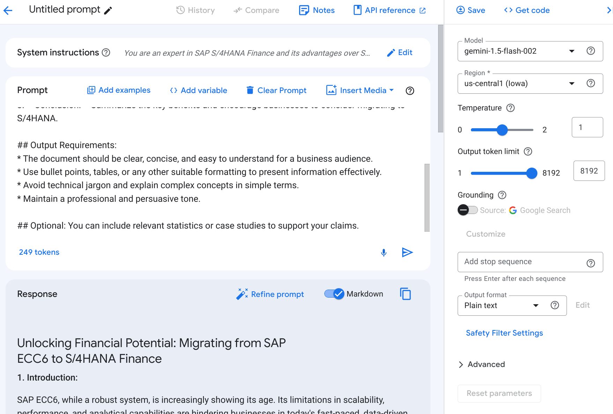

4. Feel free to experiment with the prompt, model versions, and parameters and review the results.
5. When you are happy with the result, you can save your prompt, as follows:

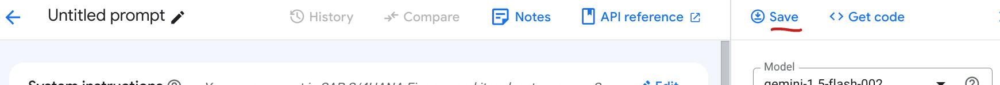

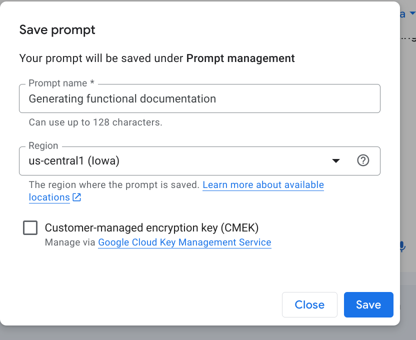

6. All your previously saved prompts can be accessed via the "Prompt Management" or "Saved prompts" section in Vertex AI Studio.

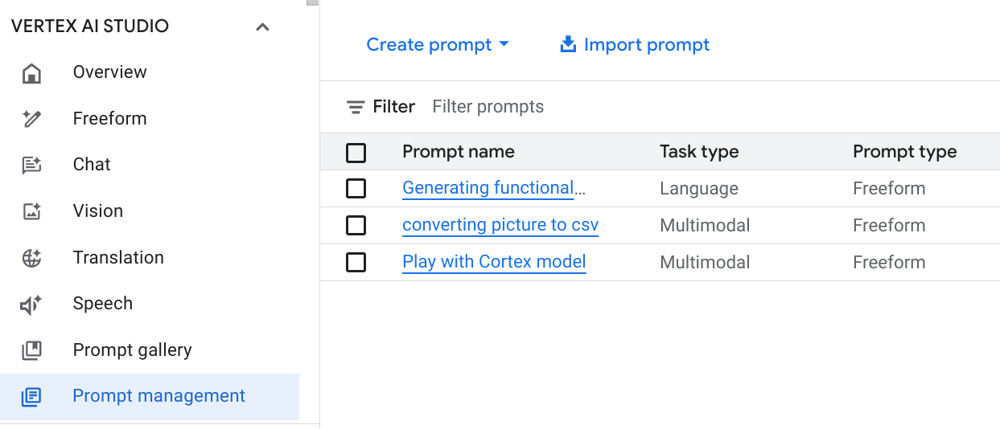

Congratulations! You've just created a prompt that helps solve a crucial problem in SAP migration projects: generating functional documentation. By using automation with Vertex AI, this task can be streamlined and executed in chunks for different product areas and modules, significantly reducing the effort required for documentation creation.

Let us move forward to the next task to explore further possibilities.


## Task 3: SAP ABAP code explanation and testing

ABAP is a high-level programming language created by SAP SE, primarily used for developing and customizing SAP business applications. It's tightly integrated with the SAP ecosystem, allowing developers to interact with various SAP modules and data structures, but it can be difficult due to its unique syntax and complex architecture compared to other common languages.

In this task, we will use the power of Google Gemini to analyze ABAP code and generate comprehensive test strategies. In particular, we will prompt Gemini for ABAP code explanation, generate test strategies to automate ABAP Code analysis and testing.

For this exercise, just as an example, we will use ABAP code developed at Google. This is a [code snippet from the Google ABAP SDK](https://cloud.google.com/solutions/sap/docs/abap-sdk/samples/trans-translate-glossary#sap-btp-edition), which is a set of libraries that allows ABAP developers to easily connect and interact with Google Cloud services like Vertex AI and Pub/Sub within their SAP applications.

1. In the Vertex AI Studio freeform, edit the system instructions 


Add the following text and **Apply** the change: "You are an experienced SAP ABAP developer."


2. In the **Prompt** area, add the following prompt:

```
I have the following ABAP code:

" --------------------------------------------------------------------
" Copyright 2024 Google LLC -
" -
" Licensed under the Apache License, Version 2.0 (the "License"); -
" you may not use this file except in compliance with the License. -
" You may obtain a copy of the License at -
" https://www.apache.org/licenses/LICENSE-2.0 -
" Unless required by applicable law or agreed to in writing, -
" software distributed under the License is distributed on an -
" "AS IS" BASIS, WITHOUT WARRANTIES OR CONDITIONS OF ANY KIND, -
" either express or implied. -
" See the License for the specific language governing permissions -
" and limitations under the License. -
" --------------------------------------------------------------------
CLASS zcl_cs_translate_with_glossary DEFINITION
PUBLIC FINAL
CREATE PUBLIC.

PUBLIC SECTION.
INTERFACES if_oo_adt_classrun.
ENDCLASS.


CLASS zcl_cs_translate_with_glossary IMPLEMENTATION.
METHOD if_oo_adt_classrun~main.
" Data Declarations
DATA lv_p_projects_id TYPE string.
DATA lv_p_locations_id TYPE string.
DATA ls_input TYPE /goog/cl_translation_v3=>ty_050.
DATA lo_exception TYPE REF TO /goog/cx_sdk.

TRY.

" Open HTTP Connection
" Pass the configured client key
DATA(lo_translate) = NEW /goog/cl_translation_v3( iv_key_name = 'TRANSLATE_DEMO' ).

" Derive project id
lv_p_projects_id = lo_translate->gv_project_id.
" Provide a location id, here 'us-central1' is uses as example
lv_p_locations_id = 'us-central1'.
" Provide MIME type
ls_input-mime_type = 'text/plain'.
" Target language code in BCP-47 format

ls_input-target_language_code = 'esES'.

" Provide glossary id
ls_input-glossary_config-glossary = 'fi_glossary_en_to_es'.

ls_input-contents = VALUE #( ( |Debit amount carry forwarded for fiscal year| ) ).

" Call the API
lo_translate->translate_text_locations( EXPORTING iv_p_projects_id = lv_p_projects_id
iv_p_locations_id = lv_p_locations_id
is_input = ls_input
IMPORTING es_output = DATA(ls_output)
ev_ret_code = DATA(lv_ret_code)
ev_err_text = DATA(lv_err_text)
es_err_resp = DATA(ls_err_resp) ).
IF /goog/cl_http_client=>is_success( lv_ret_code ).
" On successful call - print glossary translated text along with regular translation
READ TABLE ls_output-glossary_translations INTO DATA(ls_glss_translation) INDEX 1.
IF sy-subrc = 0.
out->write( | Glossary Translated Text is: { ls_glss_translation-translated_text }| ).
ENDIF.

READ TABLE ls_output-translations INTO DATA(ls_translation) INDEX 1.
IF sy-subrc = 0.
out->write( | Translated Text is: { ls_translation-translated_text } | ).
ENDIF.
ELSE.
out->write( | Error occurred: { lv_err_text }| ).
ENDIF.

" Close HTTP Connection
lo_translate->close( ).

" Handle exception
CATCH /goog/cx_sdk INTO DATA(lo_sdk_excp).
lv_err_text = lo_sdk_excp->get_text( ).
out->write( |Exception occurred: { lv_err_text } | ).
ENDTRY.
ENDMETHOD.
ENDCLASS.

Please analyze this code and provide the following information:

* Explanation: Explain what the code does step-by-step. Break down the logic and functionality into clear and understandable terms.
* Purpose: Describe why this code is needed. What problem does it solve, or what functionality does it provide within a larger program or system?

Test Strategy: Outline a comprehensive test strategy for this code, including:

* Unit Tests: Suggest specific unit tests to validate the individual components and logic of the code.
* Integration Tests: If applicable, recommend integration tests to verify how this code interacts with other parts of the system.
* Test Data: Provide examples of test data that should be used to cover different scenarios and edge cases.
* Expected Results: Define the expected outcomes for each test case.

Please be as detailed and specific as possible in your response. If there are any potential issues or areas of improvement in the code, please point them out.
```

3. Execute the prompt and review the result. 
4. Feel free to experiment with the prompt, model versions, and parameters and review the results.
5. When you are happy with the result, you can save you prompt.

Congratulations! You've just created a prompt that helps to explain the code and create a test strategy, which has potential to help development teams to increase efficiency, improve code quality, enhance collaboration, and accelerate SAP implementations.


## Task 4: Generating of a migration plan from On-Premise to Google Cloud

This exercise will utilize Gemini to generate a migration plan for our on-premises systems to Google Cloud. We can then refine and expand upon this initial draft, potentially streamlining and accelerating the early stages of our migration project.

1. In the Vertex AI Studio freeform, edit the system instructions 


Remove the text from the system instructions and **Apply** the change.


2. In the **Prompt** area, add the following prompt (you can simply copy and paste the image from the instructions to your prompt in Vertex AI Studio):

```
I have a list of on-premises SAP machines that I need to migrate to Google Cloud Platform (GCP). These machines include
```
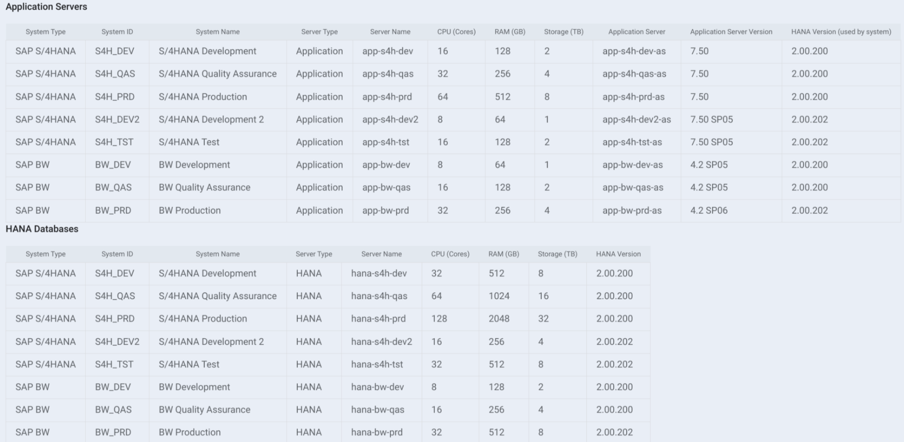
```
Please create a comprehensive migration plan that includes:

* Recommended GCP machine types for each system: Consider factors like performance, cost optimization, and scalability.
* Proposed migration timeline: Outline the sequence of migration activities, dependencies, and estimated durations.
* Potential challenges and mitigation strategies: Identify potential risks and roadblocks associated with each system's migration and suggest ways to address them.
* Cost estimation: Provide an approximate cost projection for the migration, including compute, storage, and networking costs.

Optional information that can enhance the plan:
* Any specific business requirements or constraints.
* Desired level of high availability and disaster recovery.
* Whether a lift-and-shift or a phased approach is preferred.

Please present the plan in a clear and organized format, such as a table or a bullet-point list.

```

3. Execute the prompt and review the result. 
4. Feel free to experiment with the prompt, model versions, and parameters and review the results.
5. When you are happy with the result, you can save you prompt.

Congratulations! You've just created a prompt that helps generate a draft migration plan for on-premises systems to Google Cloud. However, please note that we recommend reviewing, validating, and optimizing the results with Google Cloud experts before using this output as a final version.


## Task 5:  Developing user interface documentation and suggesting improvements

In this task, we will explore how to leverage Google Gemini to generate user documentation and identify potential UI improvements for an application based on a single screenshot.

1. In the Vertex AI Studio freeform, edit the system instructions 


Remove the text from the system instructions and **Apply** the change.

2. In the **Prompt** area, add the following prompt. Hint: You can simply copy and paste the image from the instructions to your prompt in Vertex AI Studio.

```
I have a screenshot of an SAP Fiori application. Based on this screenshot, can you please:

Generate user documentation: Assume the user has no prior experience with this specific application.
The documentation should include:
* Purpose of the application: What does it do and what business processes does it support?
* Key features and functionalities: Describe the main elements and controls in the interface and how they are used.
* Step-by-step guide for common tasks: Provide clear instructions on how to perform typical actions within the application.
* Tips and best practices: Offer any helpful advice or insights for using the application effectively.

Suggest potential UI improvements: Analyze the screenshot and identify any areas where the user interface could be enhanced.
Consider aspects like:
* Usability: Is the interface intuitive and easy to navigate?
* Accessibility: Is the application accessible to users with disabilities?
* Visual design: Is the layout clear, and are the visual elements appealing and effective?
* Efficiency: Can any tasks be streamlined or simplified?

Please provide your response in a clear and organized format, such as separate sections for documentation and UI suggestions.

```
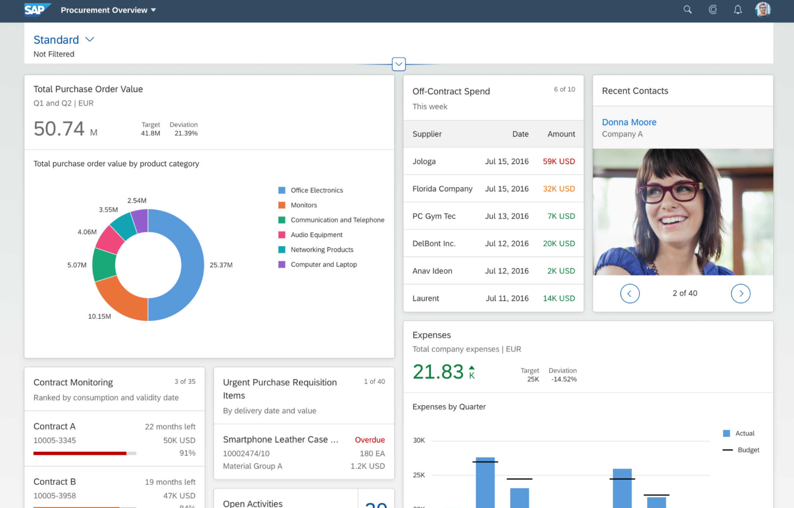

3. Execute the prompt and review the result. 
4. Feel free to experiment with the prompt, model versions, and parameters and review the results.
5. When you are happy with the result, you can save you prompt.

Congratulations! You've just created a prompt that helps generate user documentation and identify potential UI improvements for an application based on a single screenshot.


**Congratulations on finishing the lab!** You utilized Vertex AI Studio and Google Gemini to streamline IT tasks and accelerate innovation within SAP environments. Mastering prompt engineering and exploring the diverse Gemini models will unlock new levels of efficiency and creativity in your projects.

![[/fragments/endqwiklab]]

![[/fragments/copyright]]
